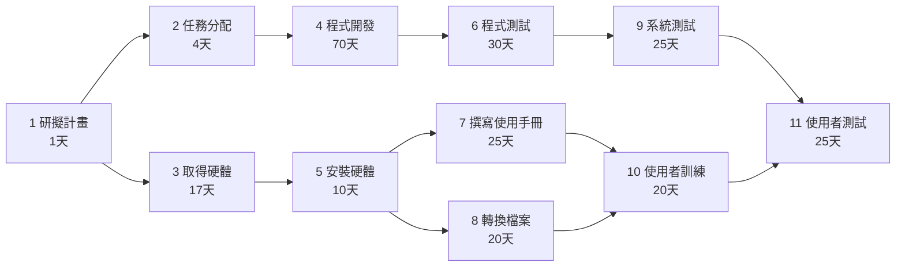
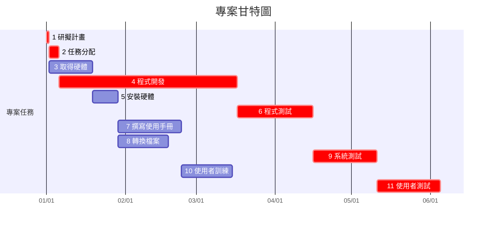

# 個人作業 2 : PERT/CPM 圖、甘特圖以及關鍵路徑

## 一、任務資料

| 任務 | 說明 | 需時(天) | 前置任務 |
|---|---|---:|---|
| 1 | 研擬計畫 | 1 | - |
| 2 | 任務分配 | 4 | 1 |
| 3 | 取得硬體 | 17 | 1 |
| 4 | 程式開發 | 70 | 2 |
| 5 | 安裝硬體 | 10 | 3 |
| 6 | 程式測試 | 30 | 4 |
| 7 | 撰寫使用手冊 | 25 | 5 |
| 8 | 轉換檔案 | 20 | 5 |
| 9 | 系統測試 | 25 | 6 |
| 10 | 使用者訓練 | 20 | 7, 8 |
| 11 | 使用者測試 | 25 | 9, 10 |

## 二、開始與結束時間

| 任務 | 說明 | 工期（天） | 開始時間 | 結束時間 |
|---|---|---:|---:|---:|
| 1 | 研擬計畫 | 1 | 0 | 1 |
| 2 | 任務分配 | 4 | 1 | 5 |
| 3 | 取得硬體 | 17 | 1 | 18 |
| 4 | 程式開發 | 70 | 5 | 75 |
| 5 | 安裝硬體 | 10 | 18 | 28 |
| 6 | 程式測試 | 30 | 75 | 105 |
| 7 | 撰寫使用手冊 | 25 | 28 | 53 |
| 8 | 轉換檔案 | 20 | 28 | 48 |
| 9 | 系統測試 | 25 | 105 | 130 |
| 10 | 使用者訓練 | 20 | 53 | 73 |
| 11 | 使用者測試 | 25 | 130 | 155 |

## 三、PERT / CPM 網路圖

## 四、甘特圖

## 五、關鍵路徑

本專案的關鍵路徑為：

**1 → 2 → 4 → 6 → 9 → 11**

各任務工期如下：

- 任務 1：1 天
- 任務 2：4 天
- 任務 4：70 天
- 任務 6：30 天
- 任務 9：25 天
- 任務 11：25 天

總工期：

**1 + 4 + 70 + 30 + 25 + 25 = 155 天**

因此，本專案的最短完成時間為 **155 天**。
